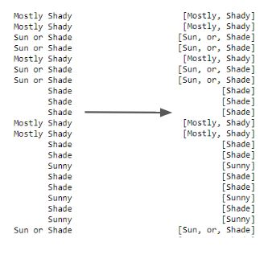
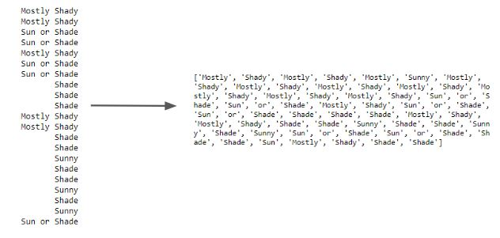
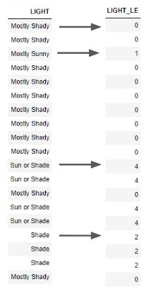
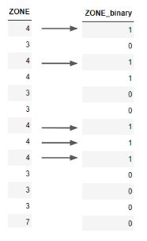

# How to Manipulate XML File

***

# 1. Importing packages

***

For a XML file, you need to import "requests" which makes it easy to extract information from a URL. Since the format is in XML, you import "xml.tree" which helps to read through the data structure. 

***

# 2. Reading Data

***

This filetype uses a parser which helps to organize the data into a pandas dataframe because it is easier to specify where each parent and child should belong.
   

***

# 3. Gathering Basic Info

***

After reading through the dataset and getting a table of values, we use a few commands to extract basic information. 

***

# 4. Cleaning data into readable format

***

After importing data values, you may need to adjust or remove the data for certain functions to be applied. 

## A)

PlantsSet : removing unneccessary columns + making price column into a float

## B)

After cleaning data, it's best to gather basic information done in step 2 to make sure the data is properly cleaned and extra column names are removed. 

***

# 5. Manipulating Data

***

## *Groupby*: 

This method clusters the output of the data depending on a specific category. For example, in the Obesity data the number of samples from each state was given. 

## *Tokenizing*:

Tokenizing is a useful technique if the data you have includes strings (ie text) because it separates the words in each row of a specific column and adds them to a list. We tokenized the "LIGHT" column to get the each word into a string. 

We can also add all of the values into a single list as in this example. This can help us count the number of times a single word is repeated in a column.    

 

## *Label Encoding*:

Label encoding is a useful way of reassigning different results in a category to a numerical value.  

Note: the category results need to be a "category" datatype before applying the code to encode the results.

 

##  *Binary*:

The point of binary coding serves as a similar purpose to label encoding where results get reassigned to different values. The only difference is that instead of having different numbers assigned according to the different results, binary encoding labels only one result with 1 and everything else is 0. This makes any comparison focused only on the column labeled "1" since all values don't produce an output.

***

# 6. Data Visualization

***

### *A) General Plot*

The first thing you can do is plot all the values on a single plot so you can get an idea of general trends and values in the data.

   

### *B) Log Plot*

It is useful to make a log plot to see the scale of the results.

   

### *C) Histogram*

A histogram distributes the results into bins depending on what the output result is.

   

### *D) Scatterplot*

This is good for comparing two parameters and seeing if there are any strong correlations.

  

### *E) Bar Graph*

This may look similar to a histogram but doesn't necessarily try to fit the results into a bell curve. Instead it just gives the actual value for each category. Representing the data in a horizontal bar graph gives a nice comparison for the different categories.

   
### *F) Heatmap*

This heatmap gives a correlation value for all parameters relative to each other. It is very nice to visually determine whether one category is correlated to another based on the color. Note: it is expected that categories compared against each other are going to be 1 meaning exact same correlation). In the plot, there should be a diagonal of 1s and both sides opposite of the diagonal should be symmetric to each other. 

### *I) Wordcloud*

A word cloud is a nice way of visualizing words depending on the frequency of their use. The size of the word correlates to the number of times the word is found in the category.

